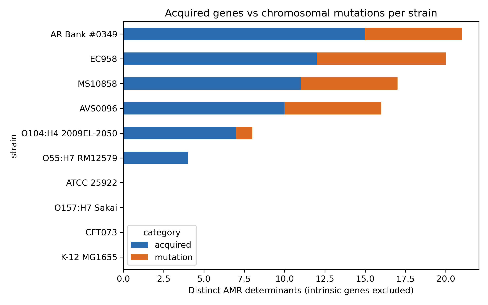
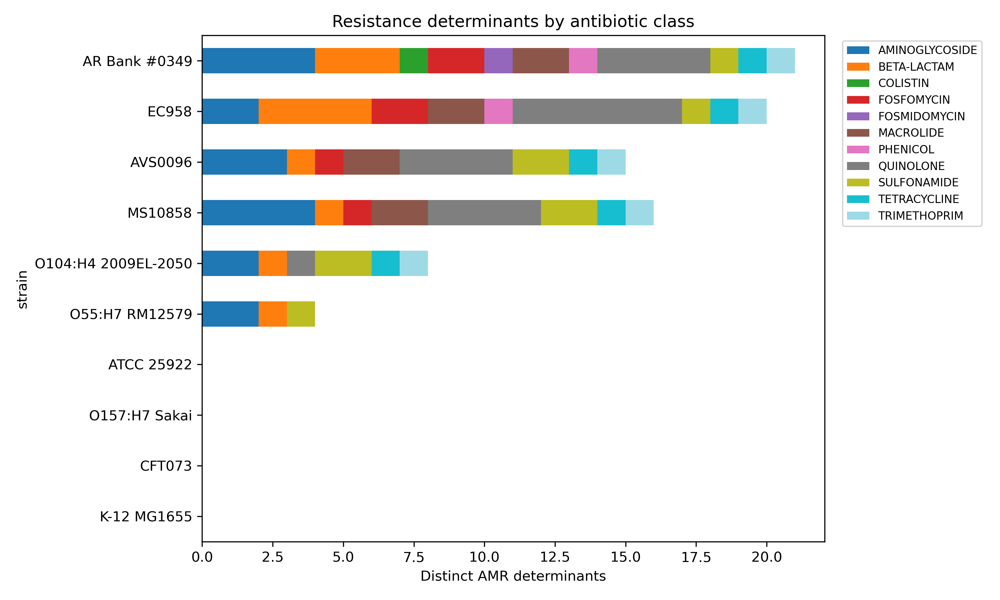
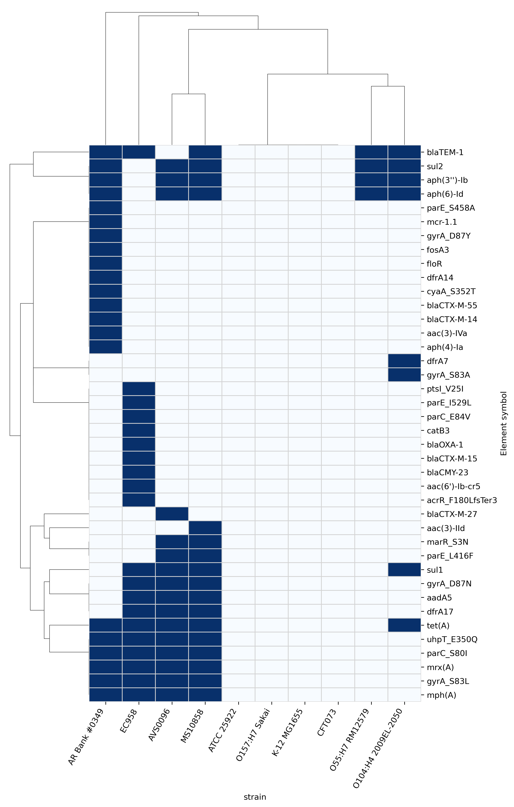
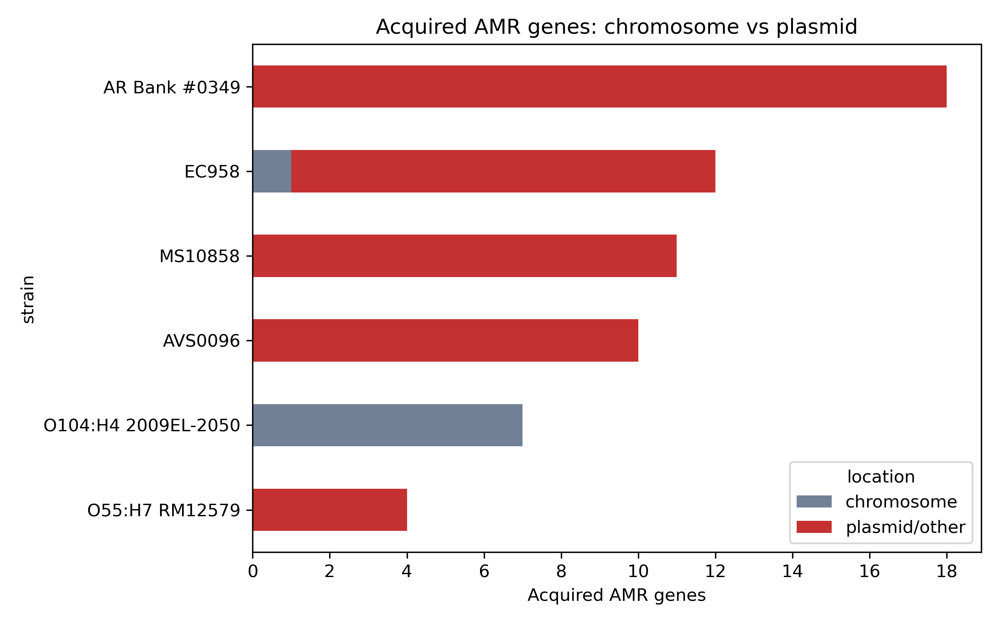

# AMR Gene Detection in Bacterial Genomes: 10 *Escherichia coli* strains

A reproducible pipeline that detects antimicrobial-resistance (AMR) genes and point mutations in 10 complete *E. coli* genomes with AMRFinderPlus, cross-validates the acquired genes with BLAST against CARD, and summarises resistance profiles with Python.

## Biological question

Which AMR genes and mutations are present in 10 *E. coli* genomes, and how do their resistance profiles differ between strains?

Sub-questions: (1) which antibiotic classes are covered per strain, (2) which strains are multidrug-resistant (determinants for 3 or more classes), (3) are the genes on plasmids or on the chromosome, (4) do two independent methods agree?

## Data

10 complete RefSeq genomes downloaded from NCBI (accessions in `data/accessions.txt`, metadata in `data/strains.csv`). The set was chosen to span susceptible reference strains and multidrug-resistant clinical or surveillance isolates.

| Accession | Strain | Role |
|---|---|---|
| GCF_000005845.2 | K-12 MG1655 | Lab reference / negative control |
| GCF_000007445.1 | CFT073 | UPEC / low-resistance comparator |
| GCF_017357505.1 | ATCC 25922 | Susceptibility reference strain |
| GCF_000285655.3 | EC958 | MDR ST131 clinical isolate |
| GCF_000245515.1 | O55:H7 RM12579 | EHEC-related / ancestral relative of O157:H7 |
| GCF_000008865.2 | O157:H7 Sakai | EHEC |
| GCF_000299255.1 | O104:H4 2009EL-2050 | EHEC outbreak strain |
| GCF_018798845.1 | AVS0096 | ST1193 / river water / blaCTX-M-27 |
| GCF_008152105.1 | AR Bank #0349 | mcr-1 on a plasmid |
| GCF_030988725.1 | MS10858 | ST1193 / clinical |

## Methods

| Step | Tool | Version / settings |
|---|---|---|
| Download | NCBI datasets | 18.38.0 |
| Genome QC | seqkit | 2.14.0 |
| AMR detection (primary) | AMRFinderPlus | 4.2.7, database 2026-08-07.1, `-O Escherichia --plus` |
| AMR detection (validation) | BLAST (blastn) vs CARD nucleotide homolog models | BLAST 2.17.0, CARD 4.0.2, e-value 1e-10, kept hits with at least 90% identity and at least 80% of the CARD gene covered |
| Analysis and figures | Python (pandas, seaborn, matplotlib) | `scripts/` |

Classification used in the analysis:
- **Intrinsic (excluded from resistance counts):** `blaEC*` (chromosomal *ampC*) and the efflux genes `acrF`, `emrD`, `mdtM`. They are found in nearly every *E. coli*.
- **Acquired genes:** all other AMRFinderPlus hits of subtype AMR.
- **Chromosomal mutations:** hits of subtype POINT / POINT_DISRUPT (for example *gyrA*, *parC*).
- Contigs: the longest sequence of each genome is treated as the chromosome and all others as plasmid/other.

## Quality control

| Strain | Sequences | Length (bp) | GC (%) |
|---|---|---|---|
| K-12 MG1655 | 1 | 4,641,652 | 50.79 |
| CFT073 | 1 | 5,231,428 | 50.47 |
| O157:H7 Sakai | 3 | 5,594,605 | 50.48 |
| O55:H7 RM12579 | 6 | 5,448,306 | 50.40 |
| EC958 | 3 | 5,249,449 | 50.81 |
| O104:H4 2009EL-2050 | 4 | 5,438,174 | 50.59 |
| AR Bank #0349 | 2 | 5,273,509 | 50.40 |
| ATCC 25922 | 4 | 5,312,633 | 50.27 |
| AVS0096 | 4 | 5,092,092 | 50.57 |
| MS10858 | 4 | 5,035,042 | 50.65 |

- All genomes are complete, of expected *E. coli* size (4.6 to 5.6 Mb) and GC content, with the chromosome in a single piece (N50 equals the chromosome length).
- CFT073 contains 87 ambiguous bases (N) out of 5.2 Mb, which is negligible.
- Negative control: MG1655, CFT073, Sakai and ATCC 25922 carry no acquired genes and no resistance mutations after intrinsic genes are excluded.
- Cross-validation: 61 of 62 acquired-gene hits were also found by CARD-BLAST at the stated thresholds. The remaining one (`catB3` in EC958) was seen by both tools but is a partial gene (70% of the reference length), below the 80% coverage cut-off.

## Results

### Resistance burden and classes

| Strain | Acquired genes | Mutations | Antibiotic classes | MDR (3+ classes) |
|---|---|---|---|---|
| MG1655, CFT073, Sakai, ATCC 25922 | 0 | 0 | 0 | no |
| O55:H7 RM12579 | 4 | 0 | 3 | yes (borderline) |
| O104:H4 2009EL-2050 | 7 | 1 | 6 | yes |
| AVS0096 (ST1193) | 10 | 6 | 8 | yes |
| MS10858 (ST1193) | 11 | 6 | 8 | yes |
| EC958 (ST131) | 12 | 8 | 9 | yes |
| AR Bank #0349 | 15 | 6 | 11 | yes |

Counts are distinct determinants, with intrinsic genes excluded.






### Biological interpretation

1. **Resistance is concentrated in the clinical or surveillance strains.** Six of the ten strains carry determinants for 3 or more antibiotic classes. The four reference strains carry none, which validates the pipeline against the negative controls. Resistance burden varies from 0 to 21 determinants.
2. **Acquired resistance is mostly plasmid-borne.** 54 of 62 acquired-gene hits (87%, counting repeated copies) are on plasmids or small replicons. The exceptions are the 7 genes of 2009EL-2050, all within about 21 kb of its chromosome (consistent with an integrated resistance island), and `blaCMY-23` on the EC958 chromosome in this assembly.
3. **A resistance gene block is shared across two lineages.** The arrangement `dfrA17, aadA5, sul1, mrx(A), mph(A)` is present in EC958 (ST131) and in AVS0096 and MS10858 (ST1193). A 9,601 bp window spanning it is 100.000% identical across all three, which indicates a shared mobile element that moved between plasmids. Direction and mechanism of transfer were not tested.
4. **Quinolone resistance is mutation-driven.** The four strains with the most mutations carry the classic *gyrA* (S83L plus D87N or D87Y) and *parC* S80I changes. No *qnr* gene was found. EC958 additionally has `aac(6')-Ib-cr5`. A gene-only presence/absence analysis would miss this signal, which is why mutations are shown separately.
5. **The two ST1193 strains have identical chromosomal mutation sets** (*marR* S3N, *gyrA* x2, *parC* S80I, *parE* L416F) although one is from river water and the other from a clinical sample. The mutations appear to follow the lineage, whereas acquired genes differ: AVS0096 has the ESBL `blaCTX-M-27`, MS10858 has `blaTEM-1` and `aac(3)-IId`.
6. **Three strains carry extended-spectrum beta-lactamases:** EC958 (`blaCTX-M-15`, plus `blaOXA-1` and `blaCMY-23`), AVS0096 (`blaCTX-M-27`) and AR Bank #0349 (`blaCTX-M-55` and `blaCTX-M-14`). **No carbapenemase gene was found in any strain.**
7. **AR Bank #0349 has the highest burden** (15 acquired genes, 11 classes), with most determinants on a single 278 kb plasmid, including `mcr-1.1` (colistin), `fosA3`, `floR` and two ESBL genes. It is the only strain with a colistin-resistance gene.
8. **The negative controls are a useful baseline:** AMRFinderPlus reports 3 to 4 hits even in MG1655, but all are intrinsic chromosomal genes (`blaEC`, efflux), not acquired resistance.

Genotype is not phenotype: all statements describe genes predicted to confer resistance.

## Limitations

- Genotype is not phenotype. No susceptibility (MIC) data were available to validate the predictions.
- Only 10 genomes, hand-selected, so no population-level or statistical claims.
- Chromosome vs plasmid assignment uses a simple rule (longest sequence = chromosome).
- Gene-level BLAST cannot detect point mutations, so all mutation results come from AMRFinderPlus only.
- Results depend on database versions and thresholds (90% identity, 80% coverage).
- Repeated copies (for example 3 copies of `tet(A)` on one plasmid in AR Bank #0349) could reflect real duplications or assembly artefacts and were not verified.
- The shared 9.6 kb block was shown by pairwise alignment only. Full plasmid comparison and the exact boundaries of the element were not done.

## Next steps

- Add strains with measured susceptibility data and compute genotype-phenotype concordance.
- Run RGI and MLST typing, and build a core-genome phylogeny to plot beside the heatmap.
- Test whether the large plasmids carry transfer (conjugation) genes.
- Scale to 50 to 100 genomes with statistics, and wrap the pipeline in Snakemake.

## Reproduce

```bash
conda create -n amr -c conda-forge -c bioconda python=3.11 ncbi-amrfinderplus blast ncbi-datasets-cli seqkit pandas matplotlib seaborn
conda activate amr && amrfinder -u
datasets download genome accession --inputfile data/accessions.txt --include genome --filename data/genomes.zip
# unzip, copy the .fna files to data/genomes/, download CARD data to data/card/
amrfinder -n data/genomes/<id>.fna -O Escherichia --plus -o results/amrfinder/<id>.tsv   # each genome
python scripts/analyze.py && python scripts/locations.py && python scripts/compare_tools.py
```

## References

- Feldgarden M. et al. AMRFinderPlus and the Reference Gene Catalog. *Sci Rep* 2021.
- Alcock B.P. et al. CARD. *Nucleic Acids Res*.
